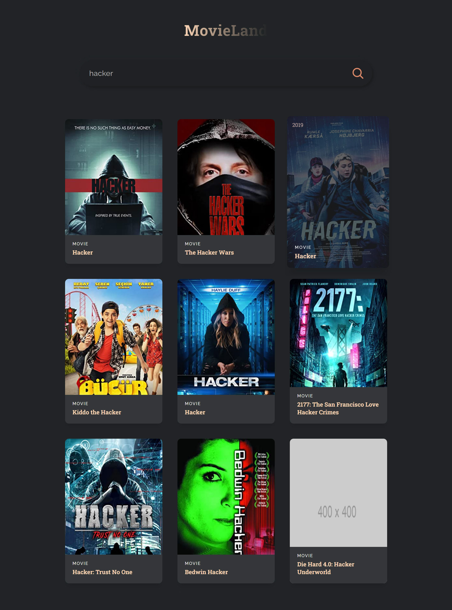

# React.js: MovieLand 

I built this project to understand fundamentals of [React.js](https://reactjs.org/)

This project is based on [React JS Full Course 2022](https://www.youtube.com/watch?v=b9eMGE7QtTk&t=1293s&ab_channel=JavaScriptMastery) course by [JSMastery](https://www.jsmastery.pro/)

## Live Demo
You can check the live demo at [MovieLand](https://reactjs.org/)

## App Preview

